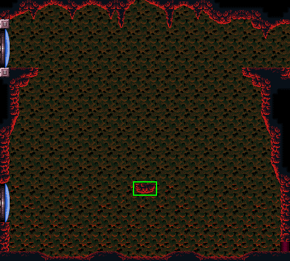
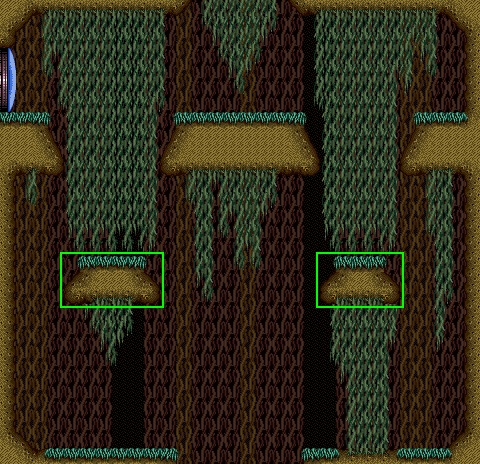
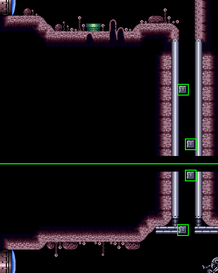
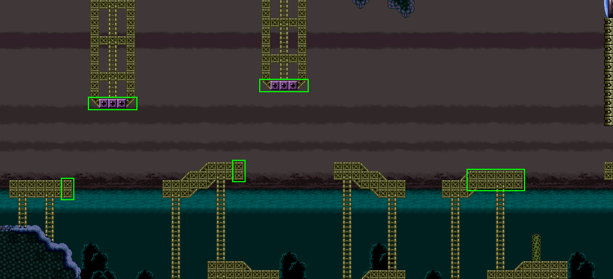

# Super Metroid Arcade Edits
A handful of edits intended for use with the romhack Super Metroid Arcade. These edits are intended to make some rooms in the hack easier to traverse.

### Important Info
These patches are specifically made for Super Metroid Arcade and will more than likely not work properly with anything else.

### Patches
[**Cool Item Rooms**](ips/cool_item_rooms.ips "cool_item_rooms.ips")
- Removes heat damage from Speed Booster Room and Post Crocomire Power Bomb Room

[**Double Chamber**](ips/double_chamber.ips "double_chamber.ips")
- Added platform for easier traversal  

[**Plasma Room**](ips/plasma_room.ips "plasma_room.ips")
- Added platforms to remove the need for bomb jumping  

[**Spore Spawn Super Room**](ips/spore_spawn_super_room.ips "spore_spawn_super_room.ips")
- Added shot blocks for easier traversal
- The rest of the room is still there the image just doesn't show everything  

**Tourian Escape Room 4**
- Coming soon...

**West Cactus Alley Room**
- Coming soon...

[**West Ocean**](ips/west_ocean.ips "west_ocean.ips")
- Raised grapple blocks and modified platforms to make jumps easier  
